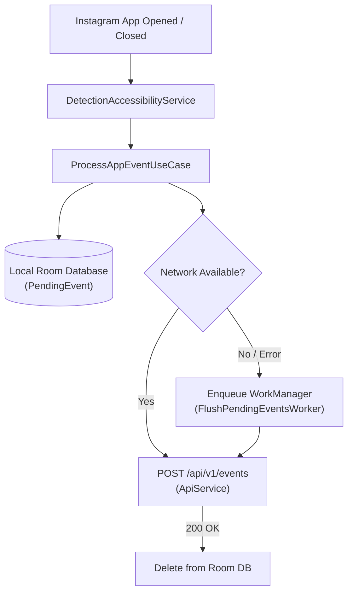

# NoInsta 📱🚫

> **Digital discipline & habit control intervention system for Android.**

NoInsta is an Android application designed to help users break compulsive social media habits by actively detecting Instagram usage and syncing sessions in real-time with an external habit-intervention backend.

---

## 🌟 Key Features

- **Real-Time App Detection**: Utilizes an Android [`AccessibilityService`](https://developer.android.com/reference/android/accessibilityservice/AccessibilityService) to detect when Instagram (`com.instagram.android`) is brought into the foreground or closed (including screen-off detection).
- **Offline-First Event Buffering**: Every session event (`INSTAGRAM_OPEN`, `INSTAGRAM_CLOSE`) is instantly persisted to a local **Room Database** and queued for network transmission. If the device is offline, **WorkManager** handles guaranteed background delivery with network constraints.
- **Cross-Device Pairing**: Connects with your intervention dashboard via a 6-digit pairing code and custom device naming.
- **Encrypted Credential Storage**: Device IDs and JWT authentication tokens are safely stored using **AndroidX Security Crypto** (`EncryptedSharedPreferences` with AES-256-GCM and AES-256-SIV).
- **Silent Token Refresh**: Built-in OkHttp `Authenticator` automatically refreshes expired access tokens without interrupting tracking.
- **Resilient Background Service**: Runs a persistent foreground service with a sticky notification and auto-restarts upon device boot (`BOOT_COMPLETED`).
- **Modern Jetpack Compose UI**: Built with 100% declarative Jetpack Compose and Material 3 design.

---

## 🏗️ Architecture & Data Flow



---

## 🛠️ Tech Stack

| Category | Technology |
|---|---|
| **Language** | [Kotlin](https://kotlinlang.org/) |
| **UI Framework** | [Jetpack Compose](https://developer.android.com/jetpack/compose) with Material 3 |
| **Architecture** | MVVM + Clean Architecture, Coroutines & Kotlin StateFlow |
| **Dependency Injection** | [Dagger Hilt](https://dagger.dev/hilt/) (`@AndroidEntryPoint`, Hilt ViewModel, Hilt Worker) |
| **Local Storage** | [Room Database](https://developer.android.com/training/data-storage/room) (SQLite) + [AndroidX Security Crypto](https://developer.android.com/topic/security/data) |
| **Background Processing**| [WorkManager](https://developer.android.com/topic/libraries/architecture/workmanager) + Android Foreground Service |
| **Networking** | [Retrofit 2](https://square.github.io/retrofit/) + [OkHttp 3](https://square.github.io/okhttp/) (Logging Interceptor & Authenticator) |
| **Serialization** | [Kotlinx Serialization](https://github.com/Kotlin/kotlinx.serialization) (JSON) |
| **Logging** | [Timber](https://github.com/JakeWharton/timber) |
| **Build System** | Gradle Version Catalog (`libs.versions.toml`) + Kotlin DSL (`build.gradle.kts`) |

---

## 🔒 Permissions & Privacy

NoInsta requires specific system-level permissions to function effectively:

- **Accessibility Service (`BIND_ACCESSIBILITY_SERVICE`)**: Detects window state changes to determine when Instagram is in the foreground. No keystrokes, personal messages, or screen content are ever inspected or recorded.
- **Foreground Service (`FOREGROUND_SERVICE_SPECIAL_USE`)**: Ensures the monitoring process is not killed by the OS under memory pressure.
- **Battery Optimization Exemption (`REQUEST_IGNORE_BATTERY_OPTIMIZATIONS`)**: Prevents OEM battery savers from terminating background monitoring.
- **Boot Completed (`RECEIVE_BOOT_COMPLETED`)**: Restarts monitoring services when the device restarts.
- **Notifications (`POST_NOTIFICATIONS`)**: Displays the required ongoing notification indicating active monitoring.

---

## 📂 Project Structure

```text
noinsta/
├── app/
│   ├── src/
│   │   ├── main/
│   │   │   ├── java/in/platesight/noinsta/
│   │   │   │   ├── data/             # Database, preferences, API models, network services
│   │   │   │   ├── di/               # Dagger Hilt dependency injection modules
│   │   │   │   ├── domain/           # Models and use cases (ProcessAppEventUseCase)
│   │   │   │   ├── receiver/         # BootCompletedReceiver
│   │   │   │   ├── service/          # Accessibility & Foreground services, WorkManager worker
│   │   │   │   ├── ui/               # Jetpack Compose UI (Screens, ViewModels, Navigation)
│   │   │   │   └── NoInstaApplication.kt
│   │   │   └── res/                  # App drawables, mipmaps, themes, XML configs
│   │   └── test/                     # Unit and instrumented tests
│   └── build.gradle.kts              # Module build configuration
├── gradle/
│   └── libs.versions.toml            # Dependency version catalog
├── build.gradle.kts                  # Root build configuration
└── settings.gradle.kts               # Gradle project settings
```

---

## 🚀 Getting Started

### Prerequisites
- **JDK 21**
- **Android SDK** (API 26 minimum, API 35 target, API 37 compile SDK)
- **Android Studio Ladybug (or newer)**

### Building & Running

1. **Clone the repository:**
   ```bash
   git clone https://github.com/SamPaw/noinsta.git
   cd noinsta
   ```

2. **Build Debug APK via CLI:**
   ```bash
   ./gradlew assembleDebug
   ```
   The compiled APK will be located at:
   `app/build/outputs/apk/debug/app-debug.apk`

3. **Install on connected device/emulator:**
   ```bash
   adb install app/build/outputs/apk/debug/app-debug.apk
   ```

4. **Or open in Android Studio:**
   - Open Android Studio, select **Open**, and navigate to the cloned `noinsta` directory.
   - Allow Gradle to sync dependencies.
   - Run the `app` configuration on your target device.

---

## 🌐 Backend API Integration

NoInsta communicates with the backend API configured in `NetworkModule.kt` (`https://noinsta.platesight.in/`):

- `POST /api/v1/pairing/claim`: Claims device with a 6-digit code.
- `POST /api/v1/events`: Submits Instagram open/close telemetry events.
- `POST /api/v1/auth/refresh`: Refreshes expired JWT tokens.
- `POST /api/v1/auth/revoke`: Unpairs device and revokes access.
- `GET /api/v1/health`: Checks backend service status.
